# Laser welding machine setup interface
## Description
### Software
This repository contains the code for the graphical user interface 
through which an operator is able to configure an adjustable automated 
fixture by inputting only the necessary geometric properties of a solar 
absorber. The fixtures' stepper motor rotation angles are calculated and 
then actuated using an arduino.

### Hardware
In a production facility manufacturing significant quantities of multiple 
variations of solar absorbers from multiple orders it is considered 
important to minimize the setup times while maintaining high product 
quality. Thus an automated configurable fixture for a laser 
welding machine is designed as a solution to this problem. The final 
purpose is to completely replace the current manual setup method with the 
designed reconfiguragle fixture. Through field observations the technical 
standards the design has to satisfy were determined, which involve 
geometric limitations and required range of motion. The final design was 
developed and optimized using CAD. The proposed design is shown below 
(only four corners of a solar absorber are shown on the table).

<p align="center">
  
</p>

The necessary components for the proof-of-concept prototype testing were 
either one of the two stepper actuated bars and any one of the rotating 
panel-stops. The final assemblies are shown in the following photos.

<p align="center">
  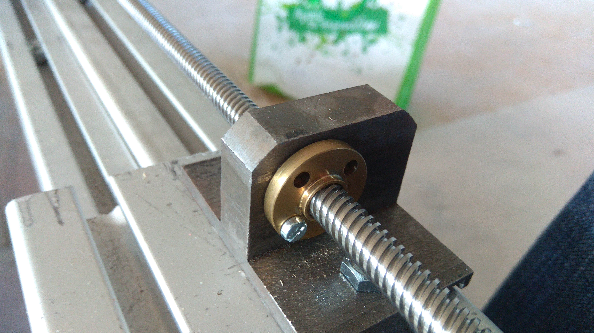
  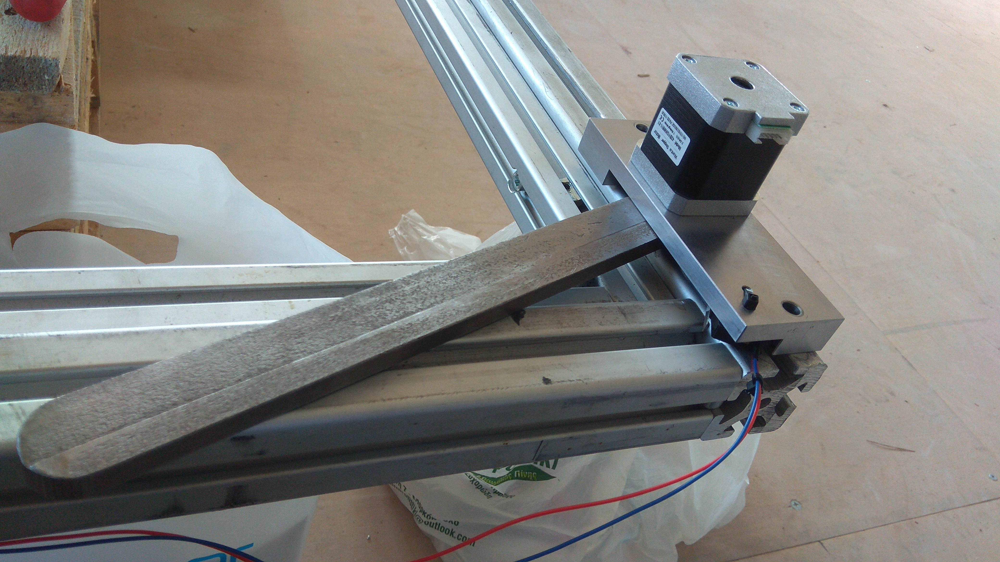
  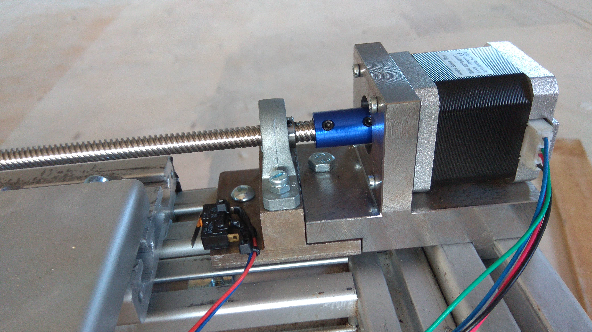
</p>

<p align="center">
  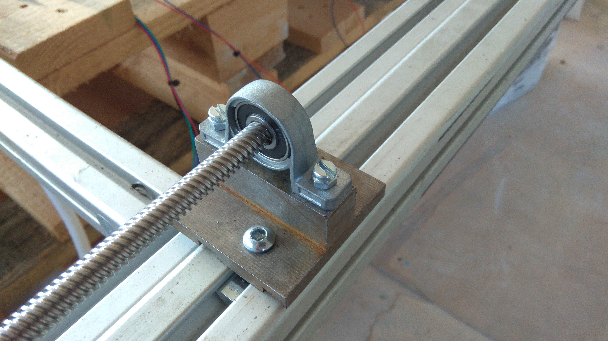
  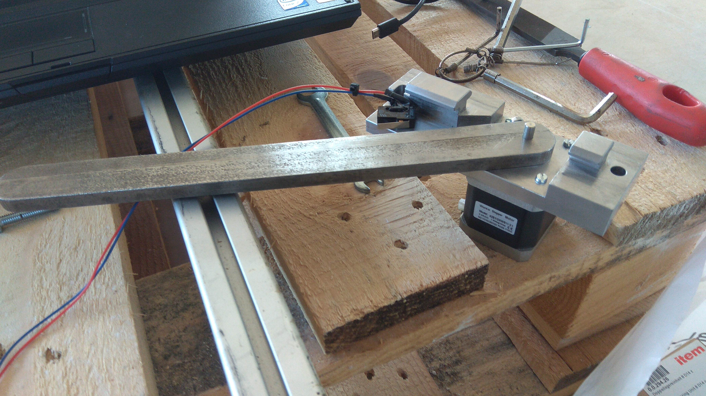
  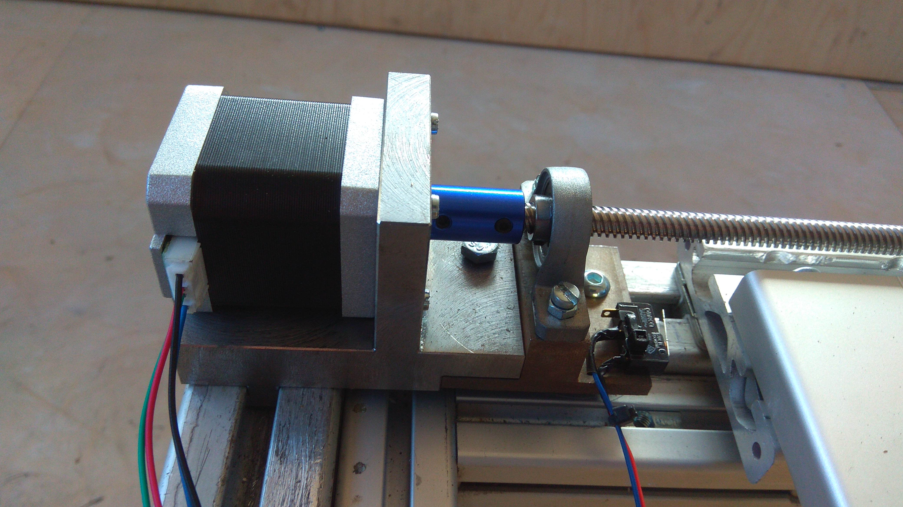
</p>

<p align="center">
  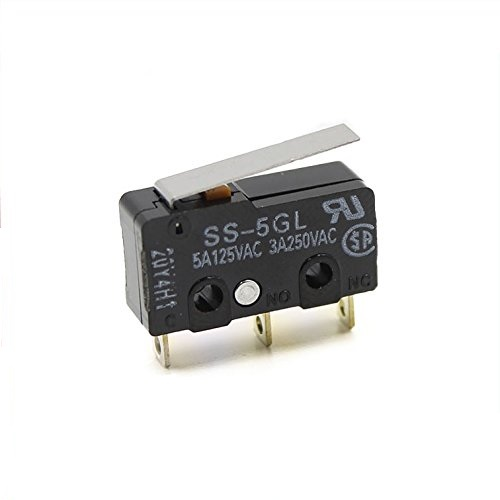
  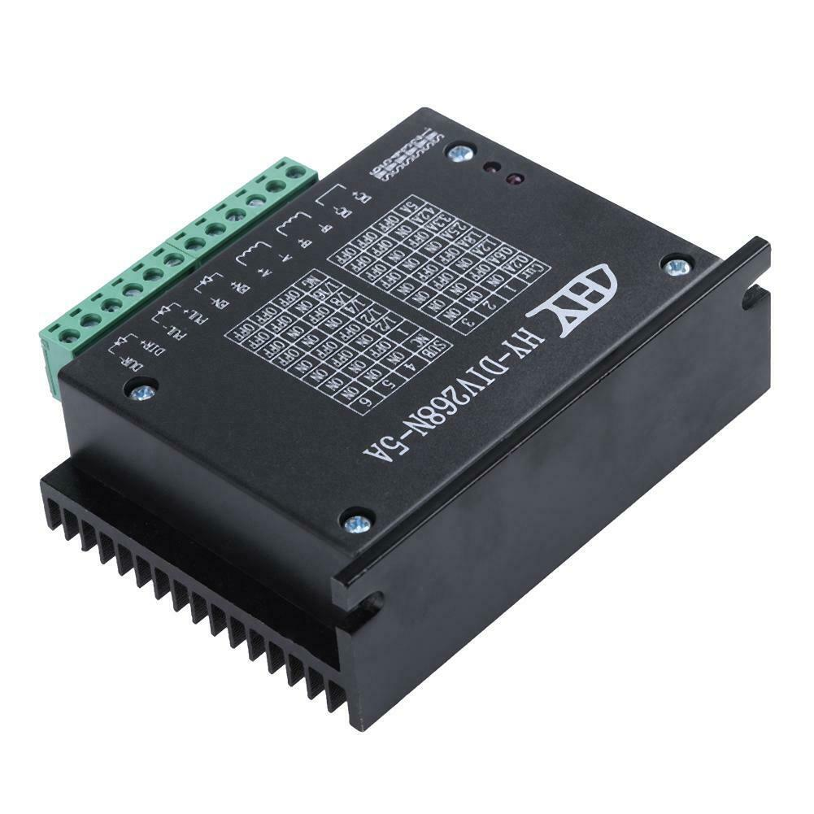
</p>

The stepper motors where operated using HY-DIV268N-5A drives, and the 
zero position was determined using SS-5GL limit switches (shown in the 
previous last two pictures). The arduino use for testing of the fixture 
is connected to 3 stepper motors and 3 limit switches at a time (two for 
one bar and one for a rotating panel-stop) the wiring diagram is shown 
below. Before every configuration procedure the fixture elements are 
homed (return to home position) determined by the limit switches' 
positions. Also, the limit switches act as additional hard safety in 
case of out of inserted values or forced motion beyond allowed limits.

<p align="center">
  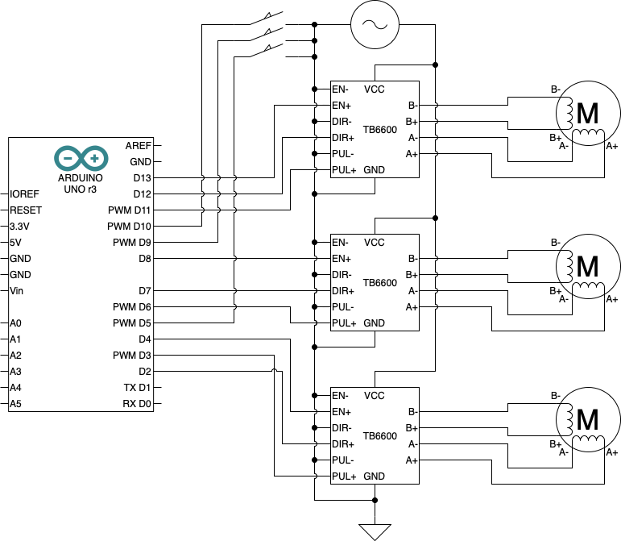

  
  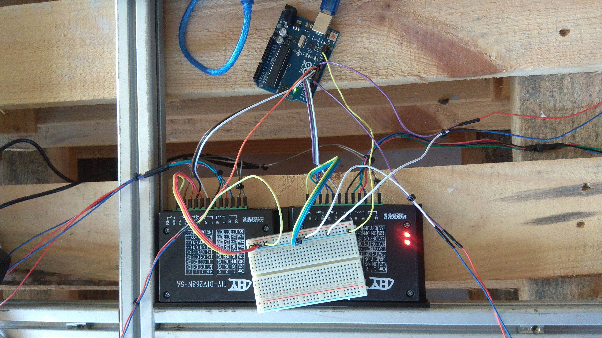
</p>

## Usage

The adjustment of the fixture is achieved by inputting the products 
required dimensions in the fields of the graphical user interface of the 
generated executable (see installation instructions), as shown below.

<p align="center">
  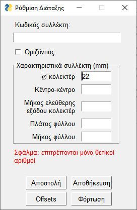
  
</p>

The required product specifications and features required as input in the 
main window (left window) are depicted in the following figure for 
vertical and horizontal solar absorber type respecitively, which is also 
inputted through a checkbox.

<p align="center">
  
</p>

With this information the required fixture elements' displacements, 
stepper motor rotation angles, and lastly required steps and directions 
are calculated. For this calculation, before the generation of the 
executable the physical parameters shown in the following figure have to 
be measured from the actual assembly and inserted as global constants in 
the constructor of the Configuration class in the file 
`configuration_utils.py`.

<p align="center">
  
</p>

Once all of the above is done, by pressing `Send` in the main window a 
text file containing the steps for each of the eight motors is generated 
in the directory of the executable. This is inserted as input in the 
arduino which in turn moves each motor.

In addition, by pressing `Offsets` a second window appears in which can 
be specified correction offset for every motor, in terms of product 
dimensions, in case there is repeated misalignment or additional manual 
correction is required. The values of the offsets window are 
automatically saved in a `.dat` file. The values of the main window can 
be saved in a file named according to the inputed product code as a 
`.cfg` file by pressing `Save` and any such file can be loaded by 
pressing the `Load` button thus eliminating repetition when setting up 
production for a known product. Over the buttons area are shown messages 
everytime an action is performed or an invalid set of parameters is 
specified thus eliminating human error.

### Features

 - [x] Automatic generation of fixture configuration stepper motion.
 - [x] Information/warnign messages.
 - [x] Capability of compensating constant error though the use of 
   offsets.
 - [x] Storing of any configuration and offsets.
 - [x] Protection against failure thanks to limit switches positioned in 
   both start and end of elements paths.

## Installation
 1. Clone this project locally.
 2. Generate the executable bundle by running:

    ``` bash
    python -m PyInstaller -w -F main.py
    ```

    inside the project directory.

### Requirements

 * [PySimpleGUI](https://github.com/PySimpleGUI/PySimpleGUI)
 * [PyInstaller](https://github.com/pyinstaller/pyinstaller)
